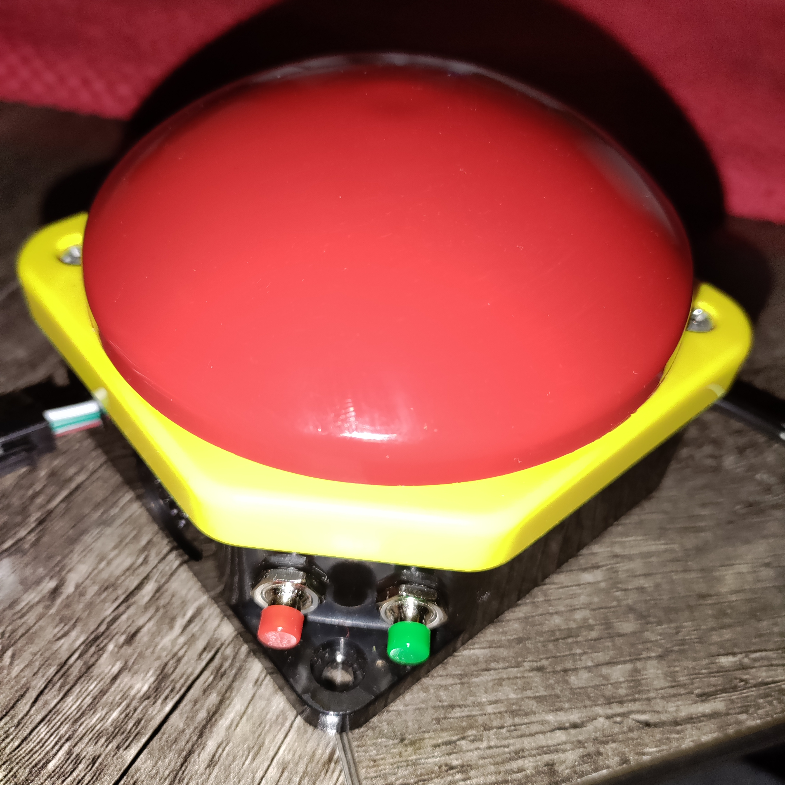
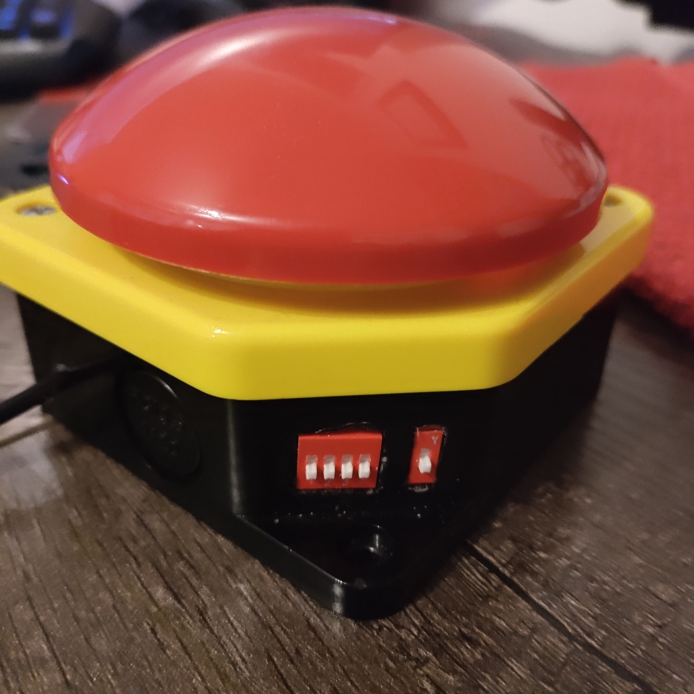

## Overview
This repo contains arduino code and documentation for a "FlashBuzzer". It's a simple industrial Big Red Button (Buzzer) with some additional buttons and dip switches attached to it. It's supposed to be rugged and installed at parties, where people can mash the button to affect lighting. There is an Output for WS2812 LED-Strips.

## Components

- Buzzer - Main Button to interact with.
- Red/Green Button - two additional pushbuttons to change values

- Program-Switches - 4 Dipswitches to input a 4-bit number (0..15) to select a mode or setting

- Settings switch - another dipswitch to change between "run mode" and "setting mode"

## Run Mode

If the settings switch is low, the buzzer is in run mode, this is the intended mode for usage. Hitting the buzzer now does something, depending on the mode you are in. In Mode zero it makes a single flash run down the led strip.

## Settings Mode

If the settings switch is high, the buzzer is in settings mode, now the 4 Program-Switches select one of 16 settings. Each Mode can use any of these settings, there are some common shared one like colors or a general "speed" property, but every mode can interpret these values differently, be aware when setting this up.
Settings are stored on EEPROM

Settings:
- Color1 - Red
- Color1 - Green
- Color1 - Blue
- Speed
- LED-Count
- Index1
- Color2 - Red
- Color2 - Green
- Color2 - Blue
- Idex2
- Color3 - Red
- Color3 - Green
- Color3 - Blue
- Random 0..255
- Broken Mode 0..10
- Broken Threshold 0..255

## Reset to Defaults

If something is not working follow these steps to reset the buzzer:
ToBeDone ;)
